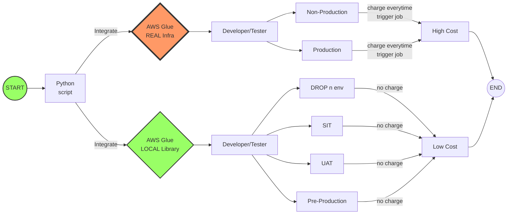

# Apply AWS Glue Library in Development
## Benefit
This article is to share the context of using AWS glue library locally for benefit of
    •	Development activities themselves.
    •	Testing.
    •	And cost saving for project.
## Context
At first, the technical approach is approved by client to implement AWS glue job for loading data from AWS S3 to Aurora RDS PostgreSQL. It's very interesting that it could be applied what we have researched by creating glue job, creating connection and creating everything need to be deployed for an ETL job. It is the most straightforward tasks to do.
## In Theory
However, life is not a dream that you have no authentication to create any glue job, connection, policy, etc... like what you researched before. In fact, if you create glue job, you must label the bill for payment. Therefore, DevOps mate will implement those tasks with minimum configurations, not developer. You may just provide information of needed configurations. What the need to do is developing without AWS environment a python script that will be integrated with glue job. Wait a minute. A hundred questions are waiting for the answers. How could you run glue job for testing? How to use AWS resource for development such as connection name, s3 bucket, etc... At the end of the day, in your hand, you optimistically have the glue job name, connection name and bucket name. They are precious ASW resource, well, let start developing python script.
## In Practical
In practical, fortunately, there is a guide to use the AWS glue library locally on AWS glue. It needs a succeeded deployment that library to continue developing and self-test. The pre-requisite condition is installing WSL then Ubuntu version 20.04, it contains some built-in software such as PostgreSQL database & python 3.8. At last, the local AWS library could be settled and run with python very smoothly. It took around 20+ hours to test and finish installing. The most struggle issue is to set up the environment when installing local AWS glue library, we are not familiar with Ubuntu enough, and so it took time.
## Conclusion
The benefit is obviously to help developer freely coding python without any dependence to AWS resource. Moreover, QC team performs the test cases in different environment without AWS glue service easily. Hence, the client is not paying for AWS service and it is cost saving benefit.
Finally, this is not invention, just a way to support development work effectively.

 
## Sample run
Run testing python script locally to process ETL pipeline using AWS Glue library for loading data from batch file in s3 to PostgreSQL without AWS Glue service
 

## References
Document for installing AWS glue libs on local

https://github.com/awslabs/aws-glue-libs or https://docs.aws.amazon.com/glue/latest/dg/aws-glue-programming-etl-libraries.html
### PySpark 3.1.1-amzn-0 (link) and Maven (link)

### Using Java JVM 11

